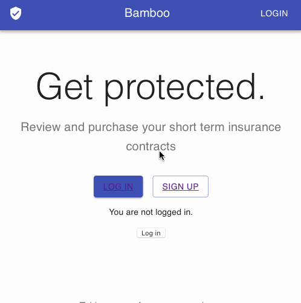

# bamboo-client

Bamboo Insurance minimum viable product (MVP) client side application. In-line with the goal of quickly building and deploying a MVP, [CodeSandbox](https://codesandbox.io) was used to bootstrap the application with [Netlify](https://netlify.com) used to deploy a live application.



## Features

- Authentication using `netlify-identity-widget` out the box functionality
- A simple set of pre-configured products to choose from
- The option to "purchase" 1 week's worth of insurance on one of the products available

## Getting up and running

The project uses `React` and `Typescript`, along with `Material-UI` for the visuals. Linting is provided by `es-lint`, and code is formatted according to the `prettier` style.

### Running locally

The project uses the `netlify-cli` package to manage deployment and development. Clone the repo locally and use `npm` to install dependencies.

```
$ npm install -g netlify-cli
$ netlify dev
```

### Deploying

Assuming you have logged into the `netlify` CLI with your account, run the following command to deploy:

```
$ netlify deploy
```
